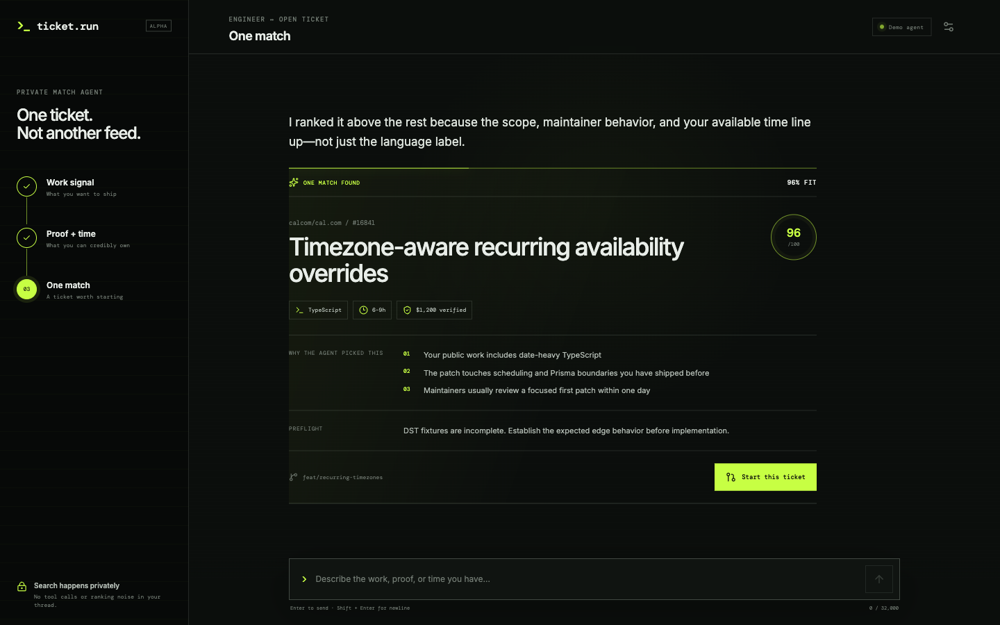

# ticket.run

An exploratory frontend for matching engineers to open tickets worth shipping.

This pivot lives on `pivot/engineer-ticket-match`; the shipped Cofounder Match product remains untouched on `main`.

[Try the live prototype](https://ticket-run-demo-akbar.netlify.app)



## Product thesis

Issue directories optimize browsing. `ticket.run` is a private chat matcher: describe what you want to ship, add one proof and time signal, and receive one ticket worth starting.

The hidden agent ranks reviewed tickets against public proof, available time, repo health, maintainer responsiveness, and expected patch surface. The frontend shows the conversation and final match—not the underlying ticket feed or tool loop.

## Prototype interactions

- Describe the desired stack, problem, or working constraint in chat
- Add a GitHub/repository proof signal and available time
- Receive one explained match inside the conversation
- Review fit evidence and preflight risk, then start the ticket
- Responsive desktop and mobile layouts

## Quick start

```bash
npm install
npm run dev
```

## Verification

```bash
npm test
npm run typecheck
npm run build
```

The existing protocol implementation remains in the branch and its 37 regression tests continue to pass. The ticket data and claim flow are curated frontend fixtures for product exploration; no GitHub account is modified.

## Current wedge

Start with active open-source repositories that have reviewed, well-scoped tickets. Match one engineer to one ticket using:

- verified language and codebase proof;
- issue clarity and acceptance criteria;
- expected effort against current availability;
- contributor merge rate and maintainer response time;
- bounty or career-proof value.

The first validation target is not signups. It is engineers who attempt a recommended ticket and maintainers who request more qualified matches.
