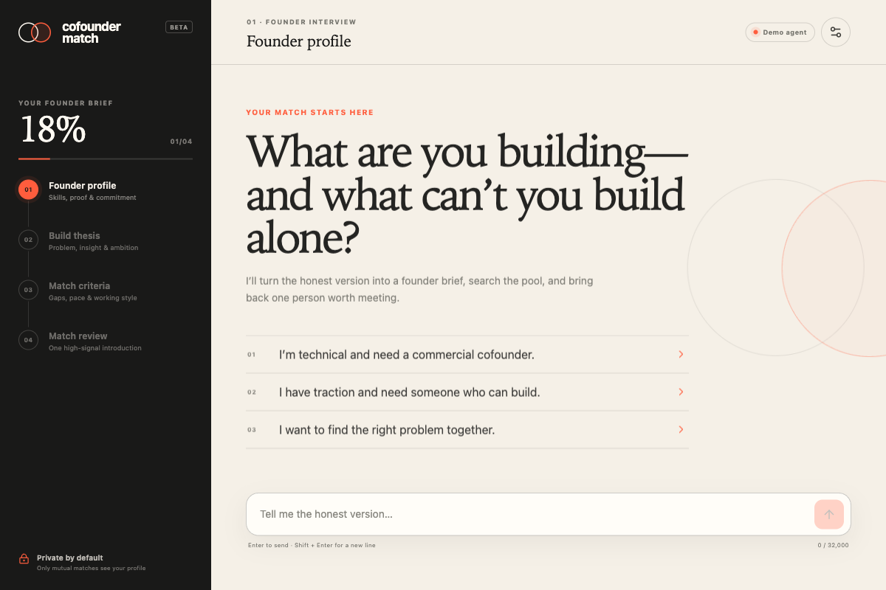

# Cofounder Match

Your AI agent for finding the person worth building with.

[Open the live product](https://akbardevop.github.io/streaming-chat-ui/) · [Read the product one-pager](docs/PRODUCT.md)



## The product

Most cofounder platforms give founders another directory to browse. Cofounder Match conducts a real founder interview, builds a structured brief, searches the candidate pool, and returns one high-signal introduction with a clear explanation of the fit and risks.

The frontend presents one simple conversation. The matching harness can privately coordinate profile analysis, complementarity scoring, compatibility red-teaming, scheduling, and trial-sprint design without exposing tool calls or internal reasoning.

## Current experience

- Four-stage founder brief: profile, build thesis, match criteria, and review
- Conversational onboarding focused on proof, commitment, gaps, pace, and working style
- Visible progress without turning the interview into a form
- Private-by-default product language and controls
- Built-in cofounder interview demo that works without a backend
- Configurable live WebSocket connection for the real matching harness
- Responsive desktop and mobile UI
- Protocol-correct streaming with 19 regression tests

## Quick start

```bash
npm install
npm run dev
```

The app starts with its local demo agent. Open **Agent settings** to connect a real WebSocket at runtime, or create `.env.local`:

```bash
VITE_CHAT_WS_URL=wss://your-api.example.com/session-chat
```

## Agent experience

```text
founder interview
      ↓
structured founder brief
      ↓
private specialist-agent harness
      ↓
one explained match
      ↓
introduction + trial sprint
      ↓
feedback improves the next match
```

The existing wire contract requires a legacy framework object during `Init`; the UI supplies it internally and never exposes those backend-specific fields to founders. See [docs/PROTOCOL.md](docs/PROTOCOL.md) for the exact transport behavior.

## Project layout

```text
src/
├── hooks/useChatProtocol.ts         React lifecycle adapter
├── protocol/
│   ├── codec.ts                     Wire encoders, decoder, scalar validation
│   ├── reducer.ts                   Connection and turn state machines
│   ├── CompatibleChatProtocol.ts    Real WebSocket manager
│   ├── DemoChatProtocol.ts          Cofounder interview simulator
│   └── *.test.ts                    Regression suite
├── App.tsx                          Founder interview and agent settings
└── styles.css                       Responsive product system and motion
```

## Commands

```bash
npm run dev        # local development
npm test           # protocol test suite
npm run typecheck  # strict TypeScript checks
npm run build      # production bundle
npm run preview    # serve the production bundle
```

## Deployment

The live site is served from the `gh-pages` branch:

```bash
npm run build
npx gh-pages --dist dist --nojekyll
```

The included manual workflows run the same verification and deployment flow through GitHub Actions when hosted runners are available.

## License

[MIT](LICENSE)
